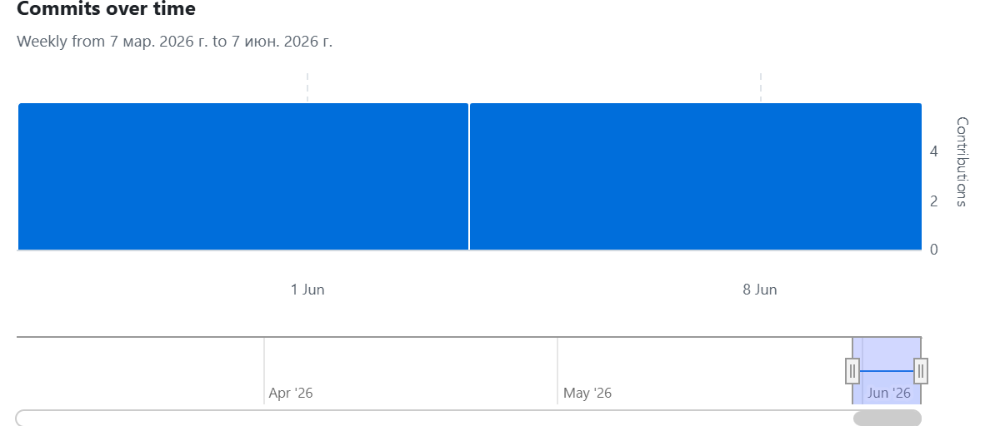
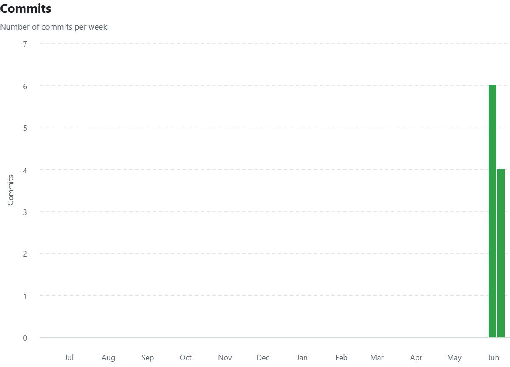

# Тонна — фронтенд

React SPA для B2B-платформы торговли сельхозпродукцией.

---

## Стек технологий

| Технология | Версия |
|---|---|
| React | 19.2.4 |
| TypeScript | 5.9.3 |
| Vite | 8.0.0 |
| React Router | 7.13.1 |
| TanStack Query (React Query) | 5.90.21 |
| Tailwind CSS | 4.2.1 |
| Radix UI / shadcn-примитивы | `@radix-ui/react-label` 2.1.8, `@radix-ui/react-slot` 1.2.4 |
| WebSocket | кастомный хук `useNotificationsWS` |

---

## Структура проекта

```
src/
├── app/
│   ├── App.tsx
│   ├── layout/
│   │   └── MainLayout.tsx
│   ├── pages/
│   │   ├── auth/
│   │   │   ├── AuthPage.tsx
│   │   │   └── OnboardingPage.tsx
│   │   ├── home/
│   │   │   ├── AboutServicePage.tsx
│   │   │   ├── BidCard.tsx
│   │   │   ├── ComingSoonPage.tsx
│   │   │   ├── CreateBid.tsx
│   │   │   ├── HomePage.tsx
│   │   │   ├── MyBidsPage.tsx
│   │   │   └── SendContactModal.tsx
│   │   ├── not-found/
│   │   │   └── NotFoundPage.tsx
│   │   └── profile/
│   │       ├── ProfilePage.tsx
│   │       ├── ProfileSidebar.tsx
│   │       ├── PublicProfilePage.tsx
│   │       ├── components/
│   │       │   ├── ContactRequestModal.tsx
│   │       │   ├── EditProfileModal.tsx
│   │       │   └── NotificationsPanel.tsx
│   │       ├── profile-utils.ts
│   │       └── sections/
│   │           ├── AdsSection.tsx
│   │           ├── ContactsSection.tsx
│   │           └── ProfileSection.tsx
│   ├── providers/
│   │   ├── AuthProvider.tsx
│   │   ├── Providers.tsx
│   │   ├── auth-context.ts
│   │   ├── queryClient.ts
│   │   └── useNotificationsWS.ts
│   └── router/
│       ├── AppRouter.tsx
│       ├── ProtectedRoute.tsx
│       └── PublicOnlyRoute.tsx
├── assets/
│   ├── logo-lockup.svg
│   ├── logo-mono.svg
│   └── logo-solid.svg
├── shared/
│   ├── api/
│   │   ├── auth-refresh.ts
│   │   ├── auth.ts
│   │   ├── bids.ts
│   │   ├── contacts.ts
│   │   ├── core.ts
│   │   ├── http.ts
│   │   ├── index.ts
│   │   ├── notifications.ts
│   │   ├── profile.ts
│   │   └── requisites.ts
│   ├── config/
│   │   ├── env.ts
│   │   └── index.ts
│   ├── lib/
│   │   ├── auth.ts
│   │   ├── index.ts
│   │   └── utils.ts
│   ├── types/
│   │   ├── auth.ts
│   │   ├── bid.ts
│   │   ├── contact.ts
│   │   ├── index.ts
│   │   ├── notification.ts
│   │   ├── profile.ts
│   │   └── requisites.ts
│   └── ui/
│       ├── index.ts
│       └── kit/
│           ├── button-variants.ts
│           ├── button.tsx
│           ├── card.tsx
│           ├── index.ts
│           ├── input-otp.tsx
│           ├── input.tsx
│           ├── label.tsx
│           └── textarea.tsx
├── index.css
├── main.tsx
└── vite-env.d.ts
```

---

## Страницы приложения

| Маршрут | Описание |
|---|---|
| `/auth` | Двухшаговая аутентификация по OTP (запрос кода → подтверждение) |
| `/onboarding` | Заполнение профиля и реквизитов после первого входа |
| `/bids` | Лента активных заявок с фильтрами по типу, культуре, региону, цене и объёму |
| `/my-bids` | Управление собственными заявками: просмотр, редактирование, удаление |
| `/profile` | Профиль пользователя, реквизиты организации, входящие и исходящие контактные запросы |
| `/profile/:userId` | Публичный профиль другого пользователя |

---

## Запуск локально

1. Клонировать репозиторий:
   ```bash
   git clone https://github.com/Andrey-Strekalov/Tonne.git
   cd Tonne
   ```

2. Установить зависимости:
   ```bash
   npm install
   ```

3. Скопировать файл окружения и указать адрес бэкенда:
   ```bash
   cp .env.example .env
   ```
   Отредактировать `.env`, задав `VITE_API_BASE_URL` (например, `http://127.0.0.1:8000`).

4. Запустить dev-сервер:
   ```bash
   npm run dev
   ```

> Бэкенд должен быть запущен отдельно — репозиторий [Fermer-back](https://github.com/Andrey-Strekalov/Fermer-back).

---

## Переменные окружения

Файл `.env` (создаётся из `.env.example`):

| Переменная | Обязательная | Описание |
|---|---|---|
| `VITE_API_BASE_URL` | да | Базовый URL бэкенд-сервера. Используется для всех HTTP-запросов и автоматически преобразуется в WebSocket-адрес (`http` → `ws`, `https` → `wss`) для канала уведомлений. |

---

## Статистика разработки

### Метрики Git
- Всего коммитов: 17
- Период: 04.06.2026 — 10.06.2026
- Средняя частота: 17 коммита/неделю

### График активности


### Тепловая карта

